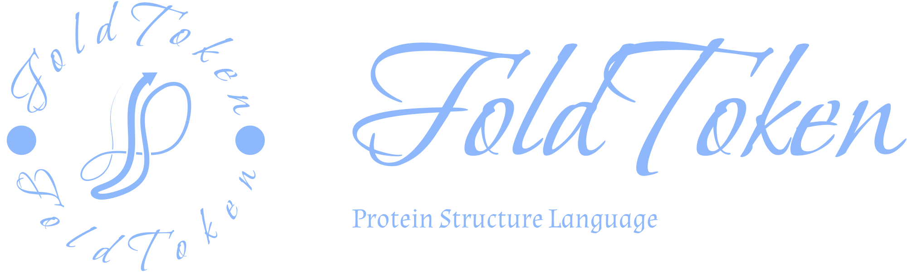
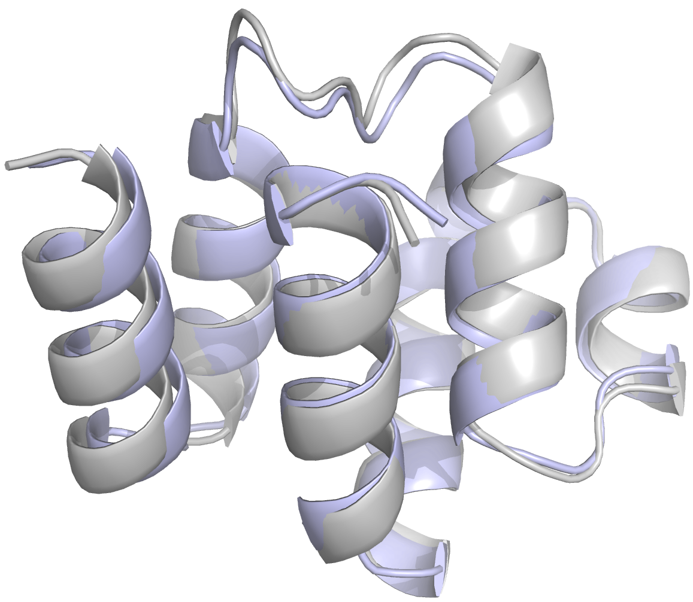
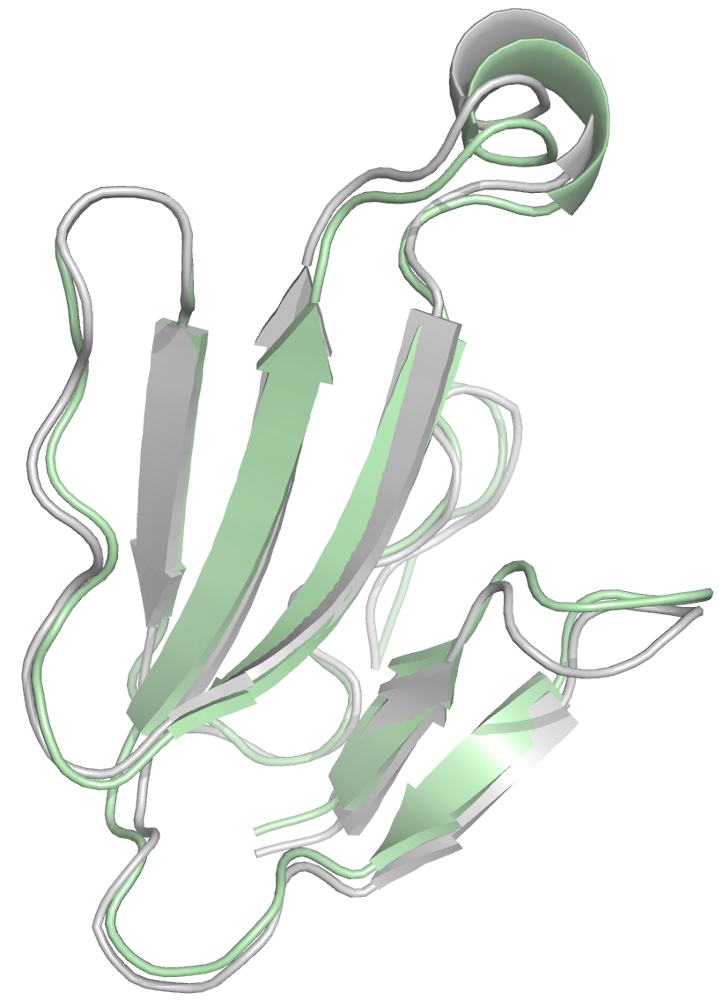

<!-- Improved compatibility of back to top link: See: https://github.com/othneildrew/Best-README-Template/pull/73 -->
<a id="readme-top"></a>
<!--
*** Thanks for checking out the Best-README-Template. If you have a suggestion
*** that would make this better, please fork the repo and create a pull request
*** or simply open an issue with the tag "enhancement".
*** Don't forget to give the project a star!
*** Thanks again! Now go create something AMAZING! :D
-->


<!-- PROJECT SHIELDS -->
<!--
*** I'm using markdown "reference style" links for readability.
*** Reference links are enclosed in brackets [ ] instead of parentheses ( ).
*** See the bottom of this document for the declaration of the reference variables
*** for contributors-url, forks-url, etc. This is an optional, concise syntax you may use.
*** https://www.markdownguide.org/basic-syntax/#reference-style-links
-->

<!-- [![Forks][forks-shield]][forks-url]
[![Stargazers][stars-shield]][stars-url]
[![Issues][issues-shield]][issues-url]
[![MIT License][license-shield]][license-url] -->


<!-- PROJECT LOGO -->
<br />
<div align="center">
  <a href="https://github.com/othneildrew/Best-README-Template">
    
  </a>

  <h3 align="center">FoldToken: A generative protein structure language!</h3>

  <!-- <p align="center">
    A generative protein structure language!
    <br />
    <a href="https://github.com/othneildrew/Best-README-Template"><strong>Explore the docs »</strong></a>
    <br />
    <br />
    <a href="https://github.com/othneildrew/Best-README-Template">View Demo</a>
    ·
    <a href="https://github.com/othneildrew/Best-README-Template/issues/new?labels=bug&template=bug-report---.md">Report Bug</a>
    ·
    <a href="https://github.com/othneildrew/Best-README-Template/issues/new?labels=enhancement&template=feature-request---.md">Request Feature</a>
  </p> -->
</div>


<!-- TABLE OF CONTENTS -->
<details>
  <summary>Table of Contents</summary>
  <ol>
    <li>
      <a href="#about-the-project">About The Project</a>
    </li>
    <li>
      <a href="#getting-started">Getting Started</a>
      <!-- <ul>
        <li><a href="#prerequisites">Prerequisites</a></li>
        <li><a href="#installation">Installation</a></li>
      </ul> -->
    </li>
    <li><a href="#usage">Usage</a></li>
    <li><a href="#downstream-tasks">Downstream Tasks</a></li>
    <li><a href="#dataset">Dataset</a></li>
    <li><a href="#license">License</a></li>
    <li><a href="#contact">Contact</a></li>
  </ol>
</details>


<!-- ABOUT THE PROJECT -->
## About The Project

[![Product Name Screen Shot][product-screenshot]](https://example.com)

This project aims to create protein structure language for unifing the modality of protein sequence and structure. Here we provide the open-source code of **FoldToken4** for research purpose. Welcome researchers to use or contribute to this project! We know that the structure language is not perfect for all downstream tasks now, we need more feedback to improve it further.

Here's why we introduce structure language:
* Unification: If we can convert data of any modality to a sequence representation, we can use the unified transformer model to solve any problem in protein modeling.
* Simplification: Structure modeling generally requires complex and inefficient model design. In comparison, the highly optimized transformer will be more suitable for scalling up.


<p align="right">(<a href="#readme-top">back to top</a>)</p>


## Getting Started
```
conda env create -f environment.yml
```


## Usage

###### Reconstruct Protein Structures
```bash
export PYTHONPATH=project_path

CUDA_VISIBLE_DEVICES=0 python foldtoken/reconstruct.py --path_in ./N128 --path_out ./N128_pred --level 8
```
One can use this script to validate the reconstruction performance of FoldToken4. The molel will encode input pdbs in **`path_in`**, reconstruct them, and save the reconstructed structures to  **`path_out`**. Users can specify **`config`** and **`checkpoint`** to select appropriate model. The codebook size is $2^{level}$, i.e., $2^{8}$ in the example.


<!-- 
 -->

<!-- <p align="center">
  
  
</p> -->


<div style="display: flex; justify-content: space-around;">
  <figure style="text-align: center;">
    
    <figcaption>8ybxR</figcaption>
  </figure>
  <figure style="text-align: center;">
    
    <figcaption>8vy8E</figcaption>
  </figure>
</div>


``` bash
8ybxR: [222, 120, 78, 191, 184, 3, 190, 182, 182, 4, 51, 254, 210, 252, 72, 188, 121, 86, 188, 236, 236, 237, 24, 195, 47, 248, 247, 192, 74, 79, 82, 27, 199, 167, 170, 70, 45, 32, 215, 14, 14, 254, 254, 59, 38, 166, 115, 98, 53, 1, 106, 79, 79, 79, 166, 240, 181, 162, 179, 96, 16, 69, 211, 112, 113, 197, 49, 56, 246, 122, 214, 119, 50, 252, 51, 51, 171, 151, 41, 185, 207, 216, 153, 243]
```

``` bash
8vy8E: [13, 186, 190, 211, 51, 178, 252, 119, 50, 103, 112, 6, 185, 190, 228, 3, 81, 139, 139, 116, 127, 242, 242, 182, 251, 38, 195, 195, 244, 86, 225, 44, 250, 180, 227, 39, 57, 142, 237, 49, 251, 51, 190, 26, 88, 139, 218, 2, 239, 43, 43, 215, 124, 60, 205, 195, 98, 166, 1, 242, 127, 191, 102, 41, 240, 211, 54, 19, 219, 194, 113, 16, 179, 162]
```

###### Batch tokenizing structures

```bash
export PYTHONPATH=project_path

CUDA_VISIBLE_DEVICES=0 python extract_vq_ids.py --path_in ./N128 --save_vqid_path ./N128_vqid.jsonl --level 8

CUDA_VISIBLE_DEVICES=0 python extract_vq_ids_jsonl.py --path_in ./pdb.jsonl --save_vqid_path ./N128_vqid.jsonl --level 8
```
One can use following script to extract vq ids from pdbs in **`path_in`**, and save it to **`path_out`**. Users can specify **`config`** and **`checkpoint`** to select appropriate model. The codebook size is $2^{level}$, i.e., $2^{8}$ in the example.


<p align="right">(<a href="#readme-top">back to top</a>)</p>


## Downstream Tasks
- [x] Structure Generation (struct->struct)
    - [x] Unconditional Generation
    - [x] Inpainiting & Scaffolding
    - [ ] Binder Design
- [x] Inverse Folding (struct->seq)
- [x] Protein Folding (seq->struct)
    - [x] Single-chain Folding
    - [ ] MSA Folding
- [ ] Function Prediction (struct->Func)

* [Structure Generation](https://choosealicense.com)
* [Inverse Folding](https://www.webpagefx.com/tools/emoji-cheat-sheet)

## Dataset

| Dataset  | Link |  Samples  | Comments
| ------------- | ------------- | ------------- |-------------  | 
| PDB | [Download](https://zenodo.org/records/13899518/files/pdb.jsonl.zip?download=1) | 162,118 | Used for pretraining, Multi-chain data | 
| CATH4.3 | [Download](https://zenodo.org/records/13899518/files/cath4.3.jsonl.zip?download=1) | 22,508 |  Single-chain Data |
| N128 | [Download](https://zenodo.org/records/13899518/files/N128.zip?download=1) | 128 | Single-chain Data, for evaluation  |
| T116 | [Download](https://zenodo.org/records/13899518/files/T116.zip?download=1) | 493 | Single-chain Data, for evaluation  |
| T493 | [Download](https://zenodo.org/records/13899518/files/T493.zip?download=1) | 493 | Single-chain Data, for evaluation  |
| M1031 | [Download](https://zenodo.org/records/13899518/files/M1031.zip?download=1) | 1031 | Protein Complex Data, for evaluation  |


<!-- * [Malven's Flexbox Cheatsheet](https://flexbox.malven.co/)
* [Malven's Grid Cheatsheet](https://grid.malven.co/)
* [Img Shields](https://shields.io)
* [GitHub Pages](https://pages.github.com)
* [Font Awesome](https://fontawesome.com)
* [React Icons](https://react-icons.github.io/react-icons/search) -->

<!-- #### Structure Generation
##### Unconditional Generation

##### Inpainiting & Scaffolding -->


<!-- This section should list any major frameworks/libraries used to bootstrap your project. Leave any add-ons/plugins for the acknowledgements section. Here are a few examples.

* [![Next][Next.js]][Next-url]
* [![React][React.js]][React-url]
* [![Vue][Vue.js]][Vue-url]
* [![Angular][Angular.io]][Angular-url]
* [![Svelte][Svelte.dev]][Svelte-url]
* [![Laravel][Laravel.com]][Laravel-url]
* [![Bootstrap][Bootstrap.com]][Bootstrap-url]
* [![JQuery][JQuery.com]][JQuery-url] -->


<!-- ## Getting Started

This is an example of how you may give instructions on setting up your project locally.
To get a local copy up and running follow these simple example steps.

### Prerequisites

This is an example of how to list things you need to use the software and how to install them.
* npm
  ```sh
  npm install npm@latest -g
  ``` -->

<!-- ### Installation

_Below is an example of how you can instruct your audience on installing and setting up your app. This template doesn't rely on any external dependencies or services._

1. Get a free API Key at [https://example.com](https://example.com)
2. Clone the repo
   ```sh
   git clone https://github.com/github_username/repo_name.git
   ```
3. Install NPM packages
   ```sh
   npm install
   ```
4. Enter your API in `config.js`
   ```js
   const API_KEY = 'ENTER YOUR API';
   ```
5. Change git remote url to avoid accidental pushes to base project
   ```sh
   git remote set-url origin github_username/repo_name
   git remote -v # confirm the changes
   ```

<p align="right">(<a href="#readme-top">back to top</a>)</p> -->


<!-- USAGE EXAMPLES -->
<!-- ## Usage

Use this space to show useful examples of how a project can be used. Additional screenshots, code examples and demos work well in this space. You may also link to more resources.

_For more examples, please refer to the [Documentation](https://example.com)_

<p align="right">(<a href="#readme-top">back to top</a>)</p> -->


<!-- ROADMAP -->
<!-- ## Roadmap

- [x] Add Changelog
- [x] Add back to top links
- [ ] Add Additional Templates w/ Examples
- [ ] Add "components" document to easily copy & paste sections of the readme
- [ ] Multi-language Support
    - [ ] Chinese
    - [ ] Spanish

See the [open issues](https://github.com/othneildrew/Best-README-Template/issues) for a full list of proposed features (and known issues).

<p align="right">(<a href="#readme-top">back to top</a>)</p> -->


<!-- CONTRIBUTING -->
<!-- ## Contributing

Contributions are what make the open source community such an amazing place to learn, inspire, and create. Any contributions you make are **greatly appreciated**.

If you have a suggestion that would make this better, please fork the repo and create a pull request. You can also simply open an issue with the tag "enhancement".
Don't forget to give the project a star! Thanks again!

1. Fork the Project
2. Create your Feature Branch (`git checkout -b feature/AmazingFeature`)
3. Commit your Changes (`git commit -m 'Add some AmazingFeature'`)
4. Push to the Branch (`git push origin feature/AmazingFeature`)
5. Open a Pull Request

### Top contributors:

<a href="https://github.com/othneildrew/Best-README-Template/graphs/contributors">
  
</a>

<p align="right">(<a href="#readme-top">back to top</a>)</p> -->


<!-- LICENSE -->
## License

Distributed under the [Apache 2.0 license](./LICENSE.txt) License. See `LICENSE.txt` for more information.

<p align="right">(<a href="#readme-top">back to top</a>)</p>


<!-- CONTACT -->
## Contact

Zhangyang Gao  - gaozhangyang@westlake.edu.cn


<p align="right">(<a href="#readme-top">back to top</a>)</p>


<!-- ACKNOWLEDGMENTS -->
<!-- ## Acknowledgments

Use this space to list resources you find helpful and would like to give credit to. I've included a few of my favorites to kick things off!

* [Choose an Open Source License](https://choosealicense.com)
* [GitHub Emoji Cheat Sheet](https://www.webpagefx.com/tools/emoji-cheat-sheet)
* [Malven's Flexbox Cheatsheet](https://flexbox.malven.co/)
* [Malven's Grid Cheatsheet](https://grid.malven.co/)
* [Img Shields](https://shields.io)
* [GitHub Pages](https://pages.github.com)
* [Font Awesome](https://fontawesome.com)
* [React Icons](https://react-icons.github.io/react-icons/search)

<p align="right">(<a href="#readme-top">back to top</a>)</p> -->


<!-- MARKDOWN LINKS & IMAGES -->
<!-- https://www.markdownguide.org/basic-syntax/#reference-style-links -->
[contributors-shield]: https://img.shields.io/github/contributors/othneildrew/Best-README-Template.svg?style=for-the-badge
[contributors-url]: https://github.com/othneildrew/Best-README-Template/graphs/contributors
[forks-shield]: https://img.shields.io/github/forks/othneildrew/Best-README-Template.svg?style=for-the-badge
[forks-url]: https://github.com/othneildrew/Best-README-Template/network/members
[stars-shield]: https://img.shields.io/github/stars/othneildrew/Best-README-Template.svg?style=for-the-badge
[stars-url]: https://github.com/othneildrew/Best-README-Template/stargazers
[issues-shield]: https://img.shields.io/github/issues/othneildrew/Best-README-Template.svg?style=for-the-badge
[issues-url]: https://github.com/othneildrew/Best-README-Template/issues
[license-shield]: https://img.shields.io/github/license/othneildrew/Best-README-Template.svg?style=for-the-badge
[license-url]: https://github.com/othneildrew/Best-README-Template/blob/master/LICENSE.txt
[linkedin-shield]: https://img.shields.io/badge/-LinkedIn-black.svg?style=for-the-badge&logo=linkedin&colorB=555
[linkedin-url]: https://linkedin.com/in/othneildrew
[product-screenshot]: foldtoken/images/screenshot.png
[Next.js]: https://img.shields.io/badge/next.js-000000?style=for-the-badge&logo=nextdotjs&logoColor=white
[Next-url]: https://nextjs.org/
[React.js]: https://img.shields.io/badge/React-20232A?style=for-the-badge&logo=react&logoColor=61DAFB
[React-url]: https://reactjs.org/
[Vue.js]: https://img.shields.io/badge/Vue.js-35495E?style=for-the-badge&logo=vuedotjs&logoColor=4FC08D
[Vue-url]: https://vuejs.org/
[Angular.io]: https://img.shields.io/badge/Angular-DD0031?style=for-the-badge&logo=angular&logoColor=white
[Angular-url]: https://angular.io/
[Svelte.dev]: https://img.shields.io/badge/Svelte-4A4A55?style=for-the-badge&logo=svelte&logoColor=FF3E00
[Svelte-url]: https://svelte.dev/
[Laravel.com]: https://img.shields.io/badge/Laravel-FF2D20?style=for-the-badge&logo=laravel&logoColor=white
[Laravel-url]: https://laravel.com
[Bootstrap.com]: https://img.shields.io/badge/Bootstrap-563D7C?style=for-the-badge&logo=bootstrap&logoColor=white
[Bootstrap-url]: https://getbootstrap.com
[JQuery.com]: https://img.shields.io/badge/jQuery-0769AD?style=for-the-badge&logo=jquery&logoColor=white
[JQuery-url]: https://jquery.com 